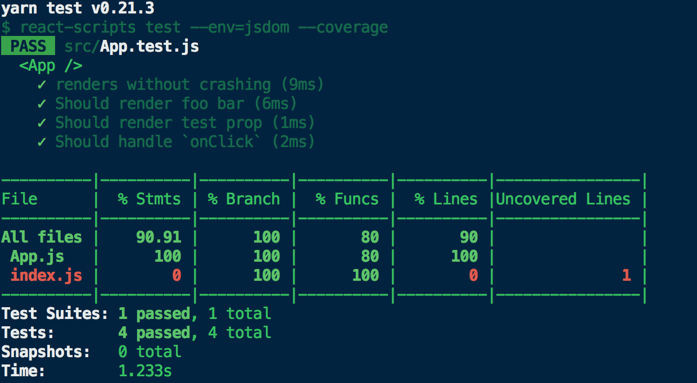
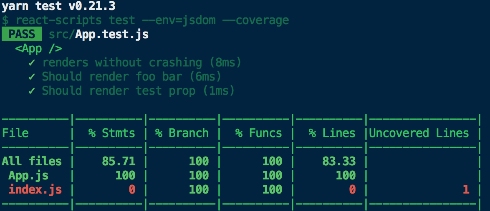
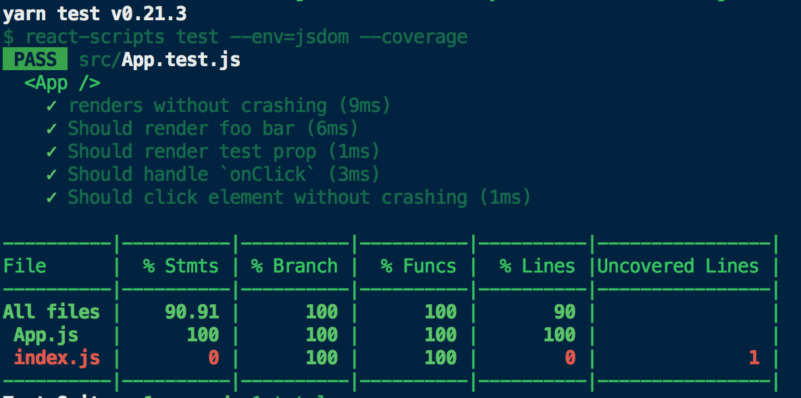

# Test Coverage

### Test coverage not ok

```sh
git checkout df56be1fb19a4ec08b6d91bec5ec9944abbe39fe
yarn test -- --coverage
```



### Test coverage ok

```sh
git checkout e664d215e904c8c53ed179298bbbb30d68db379a
yarn test -- --coverage
```




## Update:

Test coverage ok again.


The solution was simple. Test all function props when passed down and when they are not, so the component
ensures that it works even if this prop is not passed down.
```sh
git checkout master
yarn test -- --coverage
```


